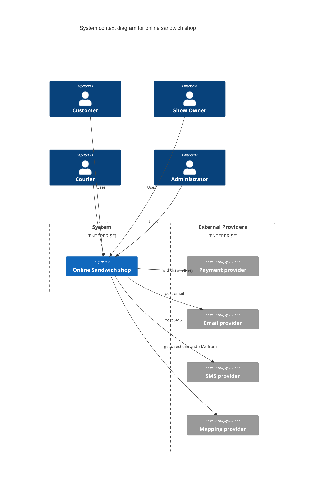
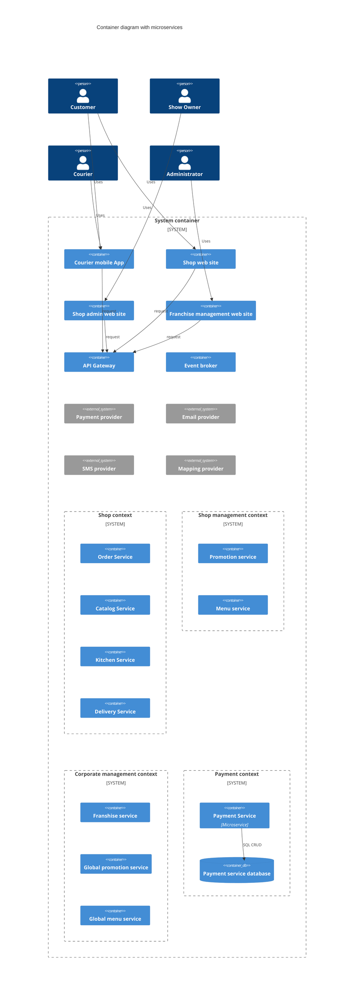

# Decomposition to microservices

## Goal
Decompose a provided case into microservices

## Service 
I'll Have the BLT - https://nealford.com/katas/list.html

A national sandwich shop wants to enable 'fax in your order' but over the Internet instead (in addition to their current fax-in service)

Users: thousands, perhaps one day millions
### Requirements:
- Users will place their order, then be given a time to pick up their sandwich and directions 
to the shop (which must integrate with several external mapping services that includes 
traffic information) 
- if the shop offers a delivery service, 
dispatch the driver with the sandwich to the user  
- mobile-device accessibility  
- offer national daily promotionals/specials 
- offer local daily promotionals/specials
- accept payment online or in person/on delivery
### Additional Context:
- Sandwich shops are franchised, each with a different owner.
- Parent company has near-future plans to expand overseas.
- Corporate goal is to hire inexpensive labor to maximize profit.

## To do
- Use cases diagram
- C4 model - containers diagram
    - https://c4model.com/
    - https://c4model.com/diagrams/deployment
- Bounded Context diagram for each microservice
- Contract for each microservice

Examples
- https://github.com/team7katas/sysopsquad?tab=readme-ov-file#process-views
- https://github.com/tekiegirl/Archangels/blob/main/2.SolutionBackground/Conceptual.md

## Solution

### DDD 
First of all, let's use DDD to decompose the system into bounded contexts

#### Event storming in DDD
Miro: [link to miro](https://miro.com/app/board/uXjVJkF2MbQ=/?share_link_id=450228953536)

As a result there are 3 bounded contexts:
- Shop context which includes shopping, cooking and delivery;
- Shop management context;
- Corporate management context;
- Payment context.

Domain events are listed in a Miro board.
Let's consider shop context as a key context in this system.

### Stakeholders
This section describes key stakeholders of the system and their architectural concerns.

#### SH-1: Customer (Availability, performance, scalability, security)
User who places orders, pay and pick up or order delivery.

- system should be available and response time is critical
- security is important due to personal data and online payment 

#### SH-2 ShopOwner (Availability, Security)
User who gets orders, process them and ship them.

- shows should be notified about order and their changes in time
- security is important because ShopOwner works with payments, customer data and accountment 

#### SH-3 Courier (Availability, performance)
User who delivers orders.

- courier should be notified about order in time 
and use location services without any issue like delays

#### SH-4 Administrator (Scalability, security)
User who owns a parent company and manager franchisers.

- it should be easy to scale the system and expand franchise

#### SH-5 Payment processor (External system)
External service required for online payments.

### Use cases
Group by business flows

#### Customer flow
##### UC-1 Get a catalog of products and promotions (SH-1)
- Customer gets catalog of products
- Customer gets catalog of promotions

##### UC-2 Create and modify cart (SH-1)
- Customer adds products to a cart
- Customer modifies/removes products in a cart

##### UC-3 Checkout and payment (SH-1, SH-5)
- Customer gets a cart to review
- Customer gets a delivery estimation
- Customer creates an order 
- Customer pays
- Customer gets order confirmation

#### Order processing and delivery flow
##### UC-4 Shop processes order (SH-2)
- Shop gets a list of orders
- Shop changes a status to `in progress` for some order
- Shop changes s status to `completed` for some order
- Shop changes a status to `ready for pickup` for some order

##### UC-5 Customer picks up an order (SH-2, SH-1)
- Customer gets notified about order in `ready to pickup` status
- Shop changes a status to `completed` for some order

##### UC-6 Courier delivers an order (SH-3)
- Courier gets a list of orders to deliver
- Courier changes a status to `in delivery` for some order
- Courier changes s status to `completed` for some order

#### Business administration flow
##### UC-7 Administrator manages national promotions (SH-4)
- Administrator gets a list of promotions
- Administrator adds/removes promotions

##### UC-8 Shop manages local promotions (SH-3)
The same as UC-7 but a specific shop and with shop as main actor

##### UC-9 Administrator creates a new shop (SH-3, SH-4)
- Administrator gets a list of shops
- Administrator creates a new shop
- Shop gets notified about creation

##### UC-10 Administrator manages some shop (SH-3, SH-4)
- Administrator gets some shop
- Administrator updates shop data
- Shop gets notified about changes

### C4 Context diagram

https://mermaid.live/edit 

### C4 Container diagram
(copy paste to mermaid live and zoom in/out)
Each service has its own database but in order to simplify the diagram databases are omitted except for payment service.

